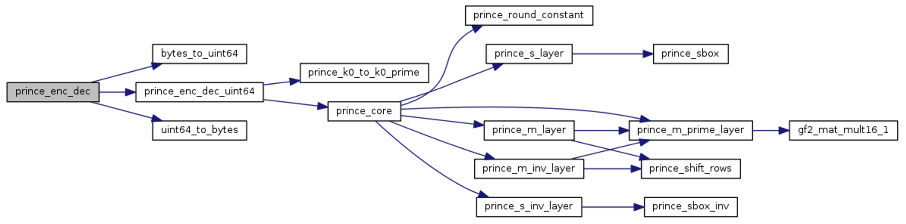

# prince-c-ref
Reference implementation of the Prince block cipher, complient to C99.
'Reference' here means straightforward, unoptimized, and checked against the few test vectors provided in the original paper (http://eprint.iacr.org/2012/529.pdf).
Some interesting features:
* It constists of a single header file, so it can be integrated in existing code very easily
* By defining the macro PRINCE_PRINT, one can print out all successive internal states (an example is provided in the file main.cpp)
* No dynamic memory allocation
* Byte oriented and uint64_t top level functions 

For those who are interested only in the intermediate values, see the file [log.txt](log.txt)

## Documentation
A Doxygen config file is in the "doxygen" folder. You can generate doc by invoking "doxygen config" from that directory. It will generate a host of information about the code.
For example the figure below is the call graph of the byte oriented to level function:

